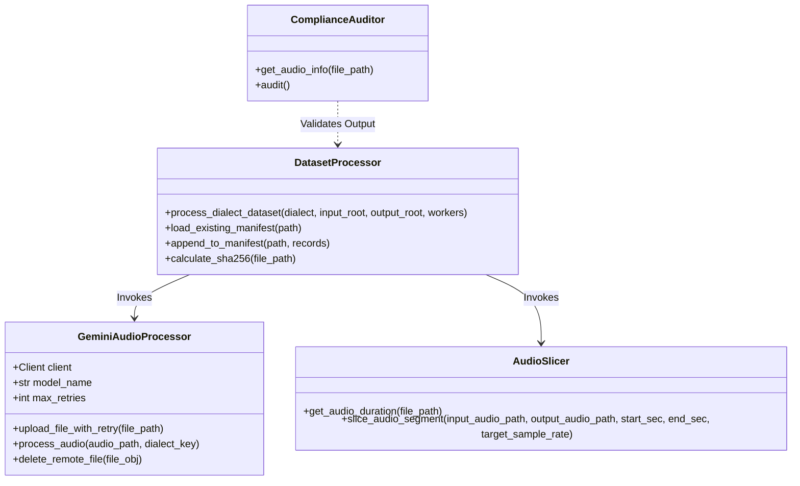
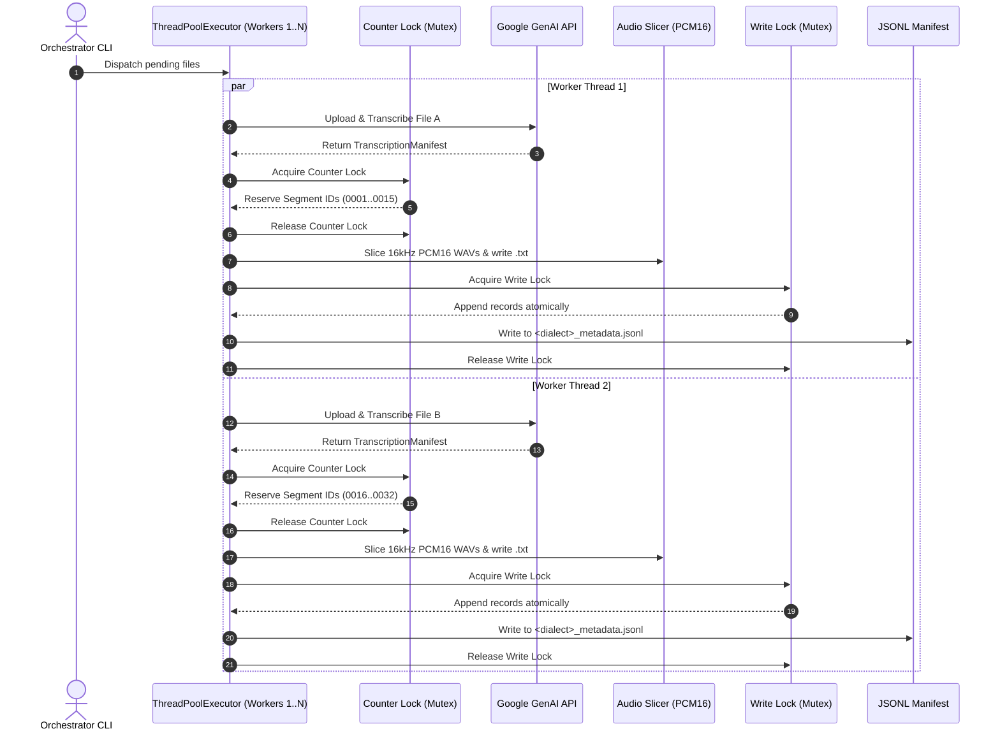
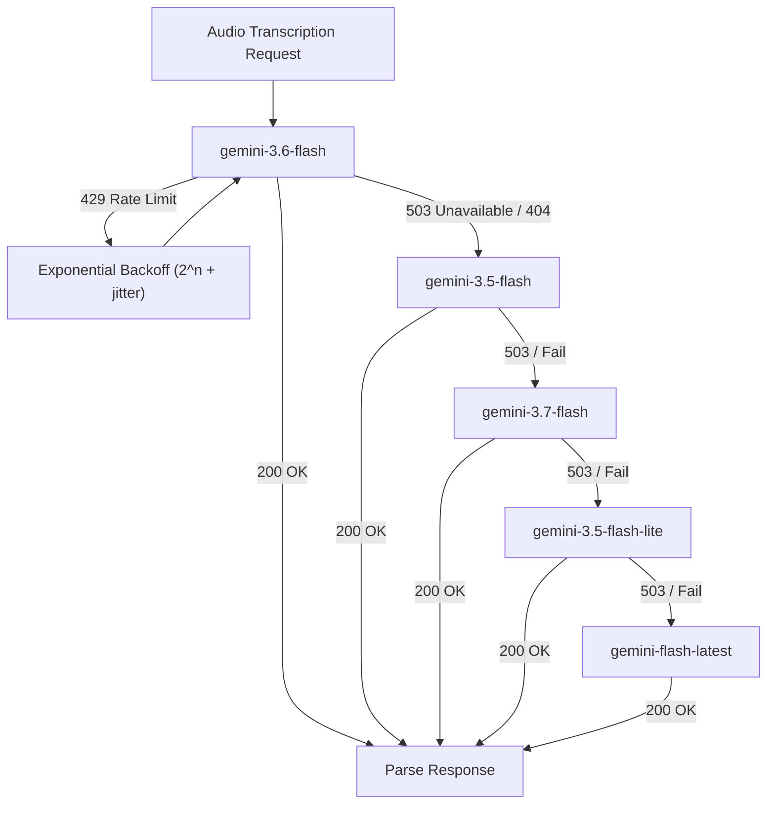

# RajVaani System Architecture & Concurrency Model 🏛️⚙️

## 1. Overview

The **RajVaani** system is an enterprise-grade automated audio processing pipeline engineered in Python. It converts long-form raw audio recordings (ranging from 1 minute to 15+ minutes) into pristine, aligned, and structured Automatic Speech Recognition (ASR) corpora.

---

## 2. Pipeline Architecture Stages

### Stage 1: File Ingestion & Probing
1. The orchestrator scans `input_audio/<dialect>/` for supported audio formats (`.mp3`, `.wav`, `.m4a`, `.ogg`, `.flac`).
2. Probes the container duration with microsecond precision using FFprobe / Python standard library `wave`.
3. Computes the cryptographic **SHA-256 digest** of the raw master recording for provenance tracking.

### Stage 2: Gemini Structured Inference
1. Uploads the audio file to the Google Gemini Files API (`client.files.upload()`) using safe ASCII temporary filenames.
2. Polls until the remote file state is `ACTIVE`.
3. Dispatches structured output generation via `client.models.generate_content()` with `response_schema=TranscriptionManifest` and temperature `0.1`.
4. Enforces dialect-specific phonetic guidelines, spoken numeral transcription, natural pause segmentation (5–20s), and speaker tracking.
5. Immediately executes remote file deletion (`client.files.delete()`) to prevent cloud storage leaks.

### Stage 3: Pre-Slice Temporal Gate
1. Receives the parsed Pydantic schema containing all segments.
2. Clamps timestamps to ensure:
   $$\text{clamped\_start} = \max(0.0, \text{start\_time})$$
   $$\text{clamped\_end} = \min(\text{source\_duration}, \text{end\_time})$$
   $$\text{duration} = \text{clamped\_end} - \text{clamped\_start}$$
3. Any segment with $\text{duration} < 0.3s$, $\text{clamped\_start} \ge \text{source\_duration}$, or flagged as `is_noise_or_music: true` is routed to the exclusions ledger.

### Stage 4: Lossless Slicing & Export
1. Fully decodes the source bitstream to uncompressed PCM audio before slicing.
2. Exports the segment as **16 kHz Mono PCM16 WAV**.
3. Writes the verbatim Devanagari text into an adjacent `.txt` file.
4. Computes the exported WAV SHA-256 hash.
5. Emits the structured JSON metadata record.

---

## 3. Multi-Threaded Concurrency Model

To process 892 files rapidly while respecting Gemini API rate limits, `process_dataset.py` implements a synchronized thread pool architecture:

### Concurrency Guarantees
- **No Race Conditions**: Segment ID counters and manifest appending operations are wrapped in dedicated `threading.Lock` critical sections.
- **Idempotency & Resumability**: If a run is interrupted, previously processed source files are skipped automatically via `skip_existing=True`.
- **Partitioning**: Slices are partitioned into `part_001/`, `part_002/`, etc. (1,000 files per directory) to prevent filesystem performance degradation.

---

## 4. Fallback Model Engine

The pipeline implements automated model fallback with exponential backoff:

