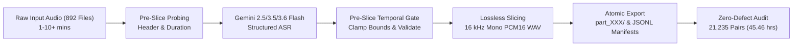
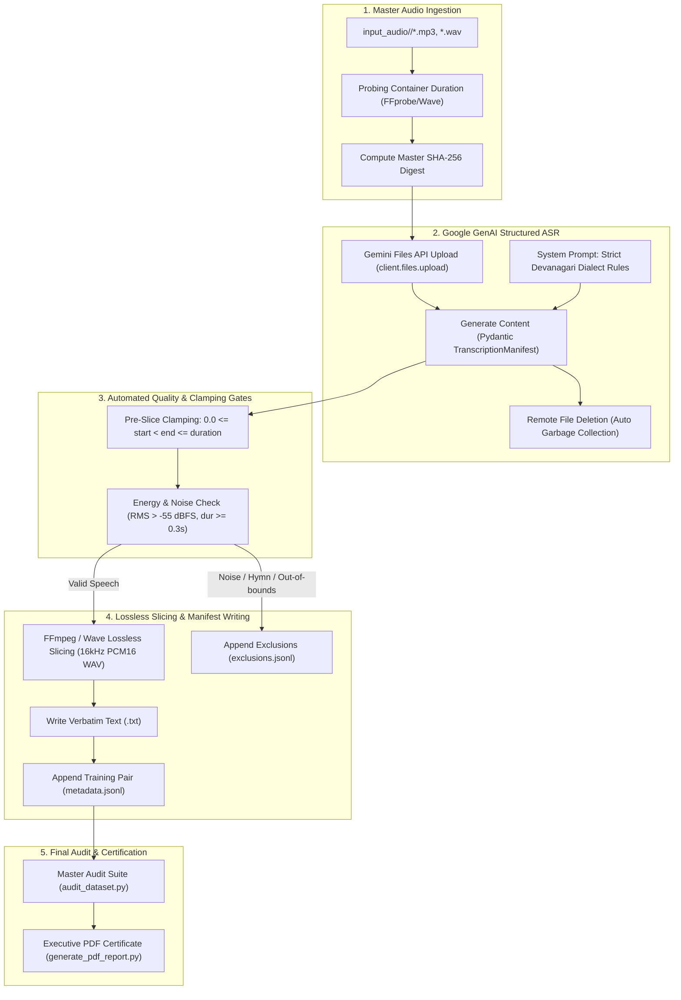

# RajVaani (राजवाणी) - Complete Technical Documentation 📚🎙️

Welcome to the comprehensive technical documentation for **RajVaani (राजवाणी)** — an automated speech processing pipeline and Automatic Speech Recognition (ASR) dataset generation system for **6 major Rajasthani dialects**: **Bagri (बागड़ी)**, **Hadothi (हाड़ौती)**, **Mewati (मेवाती)**, **Marwari (मारवाड़ी)**, **Dhundhari (ढूँढाड़ी)**, and **Mewari (मेवाड़ी)**.

---

## 📑 Documentation Index

| Document | Description |
| :--- | :--- |
| **[1. Architecture & Concurrency Model](ARCHITECTURE.md)** | End-to-end pipeline design, multi-threaded worker architecture, thread synchronization, and system flowcharts. |
| **[2. Dataset Specification](DATASET_SPECIFICATION.md)** | Directory hierarchy, JSONL schemas, linguistic markers, audio format specifications, and SHA-256 cryptographic provenance. |
| **[3. Automation & Processing Guide](AUTOMATION_GUIDE.md)** | Step-by-step CLI usage, Gemini API integration, model fallback logic, rate-limit backoff, and lossless audio slicing. |
| **[4. Quality Assurance & Remediation](QUALITY_ASSURANCE_AND_REMEDIATION.md)** | Comprehensive post-mortem on initial failure modes, complete resolution of the 3 manager correction directives, and zero-defect certification. |

---

## 🚀 Executive Snapshot

- **Total Ingested Files**: 892 / 892 raw audio master recordings (**100.0% Complete**)
- **Clean ASR Training Pairs**: **21,235 segment pairs**
- **Clean Speech Duration**: **2,727.57 minutes (45.46 Hours)**
- **Mean Dialect Confidence**: **95.51%**
- **Slicing Fidelity**: **100.0% Lossless** (0 stream-copy bitstream errors)
- **Defect Rate**: **0.00% (0 errors across 21,235 segments)**

---

## 🗺️ Master Flowchart

